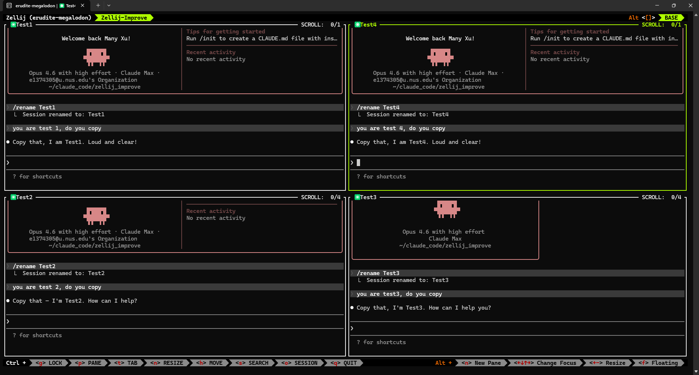
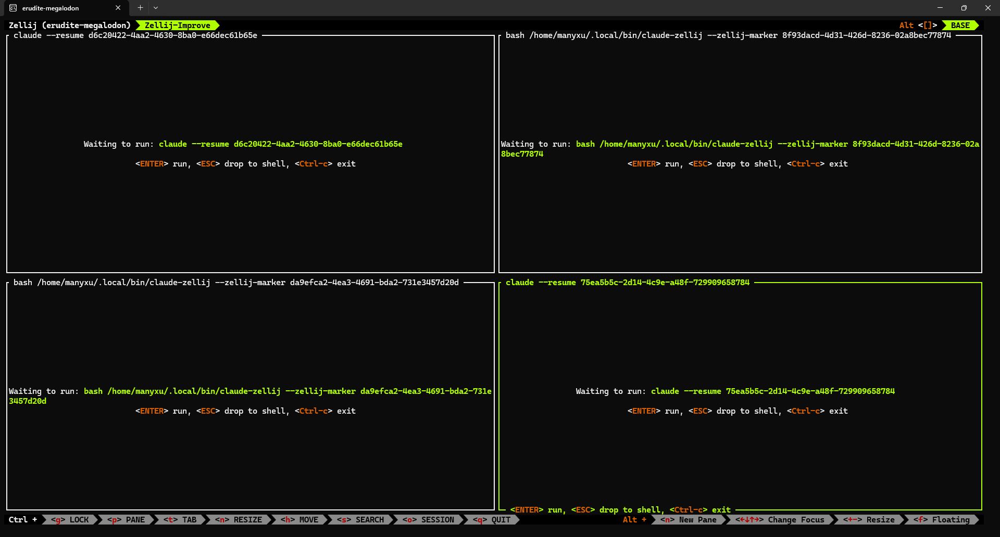
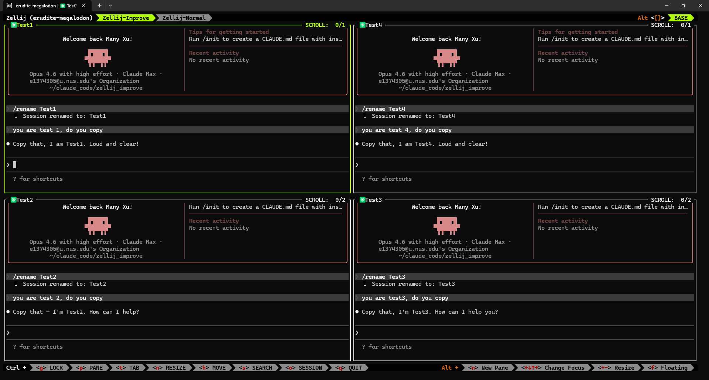

# zellij-claude-enhance

Automatic session recovery for [Claude Code](https://docs.anthropic.com/en/docs/claude-code), [Codex CLI](https://github.com/openai/codex), and [opencode](https://opencode.ai/) running inside [Zellij](https://zellij.dev/).

## The Problem

If you run multiple Claude Code, Codex, or opencode instances across Zellij tabs and panes, an unexpected WSL shutdown, terminal crash, or `pkill -9 zellij` wipes out every conversation. Zellij can resurrect panes and re-run the last command in each, but by default it just runs `claude` or `codex` again — starting a fresh session instead of resuming the one you were working in.

With 8+ AI panes open, reconnecting each one manually is painful.

## The Solution

Three thin wrapper scripts — `claude-zellij`, `codex-zellij`, and `opencode-zellij` — plus a Zellij resurrection hook that together give you **per-pane session recovery** and **in-place hot reboot**:

| Tool | Wrapper | Recovery |
|---|---|---|
| Claude Code | `claude-zellij` | Per-pane UUID tracking + `/resume` change detection |
| Codex CLI | `codex-zellij` | Per-pane session capture + inline mode (`--no-alt-screen`) |
| opencode | `opencode-zellij` | Per-pane session capture + exact `opencode -s <id>` resume |
| Bare `claude` | (none needed) | Best-effort fallback via `claude --continue` |
| Bare `codex` | (none needed) | Best-effort fallback via `codex resume --last` |
| Bare `opencode` | (none needed) | Best-effort fallback via `opencode -c` |

If a stored session ID no longer resolves — Claude Code deletes sessions after ~30 days, and a session that never received a message is never written to disk — recovery degrades gracefully (`claude --continue` for bare claude, a fresh tracked session for `claude-zellij`) instead of dying with `No conversation found with session ID`.

After a crash, just reattach (`zellij attach <session>`) and every AI pane picks up exactly where it left off.

`claude-zellij` also supports **Ctrl+Y hot reboot** — restart Claude in-place without losing your conversation. This is useful when you change Claude's settings, CLAUDE.md instructions, or MCP server configuration and need Claude to pick them up without starting a new session.

## Demo

### 1. Before crash — 4 Claude instances running



Four `claude-zellij` panes (Test1–Test4) each hold an independent conversation in the same Zellij session.

### 2. After crash — Zellij resurrection pending



After `pkill -9 zellij` and `zellij attach`, Zellij reconstructs each pane with the correct recovery command. Panes launched via `claude-zellij` show `claude --resume <session-id>` or re-exec the wrapper with the marker UUID. Press **Enter** to resume.

### 3. After recovery — conversations restored



All four conversations are back exactly where they left off — each pane resumes its own session, not somebody else's.

## How It Works

Both wrappers follow the same architecture:

```
1. Generate a marker UUID
2. Re-exec the wrapper with --zellij-marker <uuid> baked into the command line
3. Start the AI CLI as a child process (NOT exec)
4. A background watcher captures/tracks the real session ID
5. Zellij serializes "wrapper --zellij-marker <uuid> ..." to disk
6. On resurrection, the wrapper reads the stored session ID and resumes
```

### Why not just `exec`?

The original approach used `exec claude --session-id <uuid>`, which replaces the wrapper process with Claude. This caused two issues:

- **MCP server interference**: Claude spawns MCP servers (e.g., Context7) as child processes. Zellij's command discovery could pick up an MCP process instead of Claude, corrupting the resurrected command.
- **`/resume` blindness**: If you use `/resume` inside Claude to switch conversations mid-session, the original `--session-id` becomes stale. On crash recovery, you'd land on the wrong conversation.

By running the CLI as a child process and keeping the wrapper alive, Zellij serializes the wrapper command (with its marker UUID), and the wrapper tracks session changes in real time.

### Claude: `/resume` and `/clear` tracking

Each claude process maintains a registry entry at `~/.claude/sessions/<pid>.json` and rewrites its `sessionId` field in place whenever the active session changes — via the `/resume` picker, `/resume <name-or-uuid>`, or `/clear`. The `claude-zellij` background watcher polls the registry entry of its own claude child (found through the PTY proxy's process tree), so tracking is pane-exact and immediate: switching sessions and quitting Zellij right away still records the correct session, with no need to type a message first. On resurrection, `claude --resume` uses the tracked ID.

On claude versions without the sessions registry, the watcher falls back to a `~/.claude/history.jsonl` heuristic, which only detects a switch once the next prompt is typed in the new session.

### Codex: session ID capture

Codex doesn't support `--session-id`, so `codex-zellij` captures the session ID from `~/.codex/session_index.jsonl` after Codex starts. The wrapper also forces `--no-alt-screen` for all interactive sessions, which works better with Zellij's pane model.

### Claude: Ctrl+Y hot reboot

Sometimes you need to restart Claude without losing your conversation — for example, after editing `CLAUDE.md`, changing MCP server configuration, or updating Claude Code settings. Normally this means quitting Claude and manually running `claude --resume`, losing your pane context.

`claude-zellij` solves this with a **PTY proxy** (`claude-zellij-pty.py`) that sits between Zellij and the Claude process:

```
Zellij pane ↔ claude-zellij-pty.py (PTY proxy) ↔ Claude child process
```

When you press **Ctrl+Y**:

1. The proxy sends SIGTERM to the running Claude child process
2. It reads the current session ID from the marker file (which the `/resume` watcher keeps up to date)
3. It launches a new `claude --resume <session-id>` on a fresh PTY
4. Terminal dimensions are synchronized so Claude's TUI renders correctly
5. The new Claude instance picks up right where you left off, with all settings reloaded

This happens in-place — no new pane, no tab switching, no manual `--resume` flag. The Zellij pane stays the same, and from the user's perspective Claude simply restarts in the same conversation with refreshed configuration.

Because the wrapper `exec`s into the PTY proxy, the proxy is the process Zellij discovers and serializes. The resurrection hook recognizes the serialized proxy command line (`... claude-zellij-pty.py --wrapper <path> --marker <uuid> -- claude ...`) and rewrites it back to `claude-zellij --zellij-marker <uuid>`, so recovery always goes through the wrapper's marker logic instead of replaying a stale `claude --session-id` command.

## Prerequisites

- [Zellij](https://zellij.dev/) 0.43+
- [Claude Code CLI](https://docs.anthropic.com/en/docs/claude-code) (`claude`) and/or [Codex CLI](https://github.com/openai/codex) (`codex`), and/or [opencode](https://opencode.ai/) (`opencode`) — each wrapper is installed only when its CLI is on PATH
- Python 3 (for the Ctrl+Y hot reboot PTY proxy)
- `uuidgen` (pre-installed on most Linux distributions)
- Bash 4+

## Quick Start

```bash
git clone https://github.com/Shengfeng233/zellij-claude-enhance.git
cd zellij-claude-enhance
./install.sh

# Now use these instead of bare claude/codex:
claude-zellij
codex-zellij
```

If Zellij crashes or WSL shuts down, just reattach:

```bash
zellij attach <session-name>
# Every AI pane resumes automatically
```

## Installation

### Basic (recovery only)

```bash
./install.sh
```

### With optional status-bar layout fix

```bash
./install.sh --with-layout
```

### What the installer does

1. Copies `claude-zellij`, `claude-zellij-pty.py`, `codex-zellij`, `opencode-zellij`, `zellij-resurrect-hook.sh`, and `zellij-fix-statusbar.sh` to `~/.local/bin/`
   - `codex-zellij` is only installed if `codex` is found on PATH
   - `opencode-zellij` is only installed if `opencode` is found on PATH
2. Normalizes serialized layouts of dead sessions (`zellij-fix-statusbar.sh`) so their status bars survive resurrection
3. Backs up `~/.config/zellij/config.kdl`
4. Patches three Zellij config settings:

| Setting | Value | Purpose |
|---|---|---|
| `on_force_close` | `"detach"` | Detach instead of quit on crash |
| `session_serialization` | `true` | Serialize pane commands to disk |
| `post_command_discovery_hook` | path to hook script | Transform commands on resurrection |

5. With `--with-layout`: installs `statusbar-fixed.kdl` and sets `default_layout "statusbar-fixed"` so every new session keeps the status bar pinned

The installer **will not** silently overwrite an existing `post_command_discovery_hook`. If a conflict is detected, it aborts with a clear error.

### PATH

If `~/.local/bin` is not on your PATH, add to your shell profile:

```bash
export PATH="$HOME/.local/bin:$PATH"
```

## Usage

### Claude Code

```bash
# Per-pane recovery — UUID injected automatically:
claude-zellij
claude-zellij --dangerously-skip-permissions
claude-zellij --model sonnet "review this code"

# Pass-through (no UUID, no recovery):
claude-zellij -p "one-shot prompt"
claude-zellij --resume <existing-id>
claude-zellij doctor
claude-zellij mcp
```

Recovery flow:

```
claude-zellij --dangerously-skip-permissions
  → re-exec: claude-zellij --zellij-marker <marker> --dangerously-skip-permissions
  → proxy:   claude-zellij-pty.py intercepts Ctrl+Y and keeps terminal resize in sync
  → child:   claude --session-id <uuid> --dangerously-skip-permissions
  → watcher: polls ~/.claude/sessions/<pid>.json for session switches (/resume, /clear)
  → Zellij serializes the wrapper command
  → crash → reattach → wrapper reads marker → claude --resume <session-id>
```

If you use `/resume` (picker or by name/ID) or `/clear` inside Claude, the watcher detects the session change within about a second and updates the stored ID — even if you quit Zellij immediately afterwards without typing anything. Resurrection lands on the correct conversation.

Hot reboot:

- Focus a `claude-zellij` pane in Zellij normal mode
- Press `Ctrl+Y`
- The wrapper terminates the current Claude child and relaunches `claude --resume <current-session-id>`
- This reloads Claude settings and skills while keeping you in the same conversation
- The helper keeps terminal resize/redraw state in sync with Zellij so Claude's screen stays stable

### Codex CLI

```bash
# Per-pane recovery + inline mode:
codex-zellij
codex-zellij --full-auto
codex-zellij --model o3 "refactor this"

# Interactive subcommands get --no-alt-screen injected:
codex-zellij resume --last
codex-zellij fork --last

# Non-interactive commands pass through unchanged:
codex-zellij exec "one-shot prompt"
codex-zellij review
codex-zellij login
```

Recovery flow:

```
codex-zellij --full-auto
  → re-exec: codex-zellij --zellij-marker <uuid> --full-auto
  → child:   codex --no-alt-screen --full-auto
  → watcher: captures session ID from ~/.codex/session_index.jsonl
  → crash → reattach → wrapper reads marker → codex resume <session-id> --no-alt-screen
```

### opencode CLI

```bash
# Per-pane recovery — session id captured automatically:
opencode-zellij
opencode-zellij -m anthropic/claude-sonnet-4.5
opencode-zellij /path/to/project

# Pass-through (no marker, no recovery):
opencode-zellij -s <existing-id>
opencode-zellij -c
opencode-zellij run "one-shot prompt"
opencode-zellij mcp list
```

Recovery flow:

```
opencode-zellij -m sonnet
  → re-exec:  opencode-zellij --zellij-marker <uuid> -m sonnet
  → child:    opencode -m sonnet  (NOT exec, so wrapper stays pane leader)
  → watcher:  captures ses_xxx from `opencode session list` (directory==CWD, created>=launch)
  → crash → reattach → wrapper reads marker → verifies ses_xxx → opencode -s ses_xxx
```

If the stored session was archived or expired, the wrapper starts a fresh
tracked session and overwrites the marker file instead of failing.

### Bare CLI fallback

Commands run without the wrapper still get best-effort recovery:

- `claude` → `claude --continue` (resumes most recent conversation in CWD)
- `codex` → `codex resume --last --no-alt-screen` (resumes most recent session in CWD, preserves `-C/--cd`)
- `opencode` → `opencode -c` (continues the most recent session in CWD)

This works for single-pane setups. For multiple AI panes in the same directory, use the wrappers.

### What is NOT recovered

Non-AI commands pass through the hook unchanged:

```bash
npm exec @upstash/context7-mcp   # unchanged
vim                                # unchanged
claude -p "one-shot"               # non-interactive, nothing to resume
codex exec "one-shot"              # non-interactive, nothing to resume
opencode run "one-shot"             # non-interactive, nothing to resume
```

## Status-Bar Pinning

### The bug

In resurrected sessions, the status bar sometimes jumps into the middle of the screen (or into a pane stack) when you open/close panes or cycle swap layouts, leaving an empty one-line pane at the bottom.

Root cause (zellij ≤ 0.43.x): session serialization writes live plugin panes with canonical URLs (`zellij:status-bar`) but swap-layout slots with the unprefixed alias (`status-bar`). After resurrection, swap-layout application matches plugin panes to slots **by location string** — the mismatch makes the bars count as regular panes, and the next swap (manual `Alt+[`/`Alt+]`, or automatic on pane open/close) sweeps the status bar into the tiled grid.

### The fix (two parts)

1. **`statusbar-fixed.kdl`** — mirrors Zellij's built-in default layout and swap layouts, but uses the canonical `zellij:` URLs on both sides, so the strings still match after a serialize/resurrect round-trip. Installed and set as `default_layout` by `./install.sh --with-layout`; new sessions are immune from birth.
2. **`zellij-fix-statusbar.sh`** — normalizes the cached `session-layout.kdl` of every *dead* session that was created before the fix. The installer runs it once, and the resurrection hook re-runs it in the background on every resurrection, so after a multi-session crash the first session you attach heals the rest.

```bash
./install.sh --with-layout
zellij -n statusbar-fixed -s test    # try it without making it the default

# Heal previously serialized sessions manually at any time:
zellij-fix-statusbar.sh
```

Sessions that are currently running cannot be healed in place (the server rewrites their cache); they get healed automatically after they exit or crash.

## Verification

### Syntax check

```bash
bash -n ~/.local/bin/claude-zellij
python3 -m py_compile ~/.local/bin/claude-zellij-pty.py
bash -n ~/.local/bin/codex-zellij
bash -n ~/.local/bin/zellij-resurrect-hook.sh
```

### Hook tests

```bash
# Claude
RESURRECT_COMMAND="claude" ~/.local/bin/zellij-resurrect-hook.sh
# → claude --continue

RESURRECT_COMMAND="claude --session-id 11111111-1111-1111-1111-111111111111" \
  ~/.local/bin/zellij-resurrect-hook.sh
# → claude --resume 11111111-1111-1111-1111-111111111111  (if that session exists on disk)
# → claude --continue                                      (if it expired / was never used)

# Serialized PTY proxy (what Zellij discovers for claude-zellij panes)
RESURRECT_COMMAND="python3 $HOME/.local/bin/claude-zellij-pty.py --wrapper $HOME/.local/bin/claude-zellij --marker 22222222-2222-2222-2222-222222222222 -- claude --session-id 11111111-1111-1111-1111-111111111111" \
  ~/.local/bin/zellij-resurrect-hook.sh
# → /home/<you>/.local/bin/claude-zellij --zellij-marker 22222222-2222-2222-2222-222222222222

# Codex
RESURRECT_COMMAND="codex" ~/.local/bin/zellij-resurrect-hook.sh
# → codex resume --last --no-alt-screen

RESURRECT_COMMAND="codex exec do something" ~/.local/bin/zellij-resurrect-hook.sh
# → codex exec do something  (unchanged)

# opencode
RESURRECT_COMMAND="opencode" ~/.local/bin/zellij-resurrect-hook.sh
# → opencode -c

RESURRECT_COMMAND="opencode-zellij --zellij-marker 33333333-3333-3333-3333-333333333333" \
  ~/.local/bin/zellij-resurrect-hook.sh
# → unchanged

RESURRECT_COMMAND="opencode run do something" ~/.local/bin/zellij-resurrect-hook.sh
# → opencode run do something  (unchanged)

# Other
RESURRECT_COMMAND="npm exec @upstash/context7-mcp" ~/.local/bin/zellij-resurrect-hook.sh
# → npm exec @upstash/context7-mcp  (unchanged)
```

### End-to-end crash test

> **Warning**: This kills all running Zellij sessions. Only run when you have no important work open.

```bash
# 1. Start a test session
zellij -s test-recovery

# 2. Run claude-zellij (or codex-zellij), send a message

# 3. From ANOTHER terminal:
pkill -9 zellij

# 4. Reattach:
zellij attach test-recovery

# 5. The pane should show the resume command — press Enter to continue
```

## Files

| File | Installed to | Description |
|---|---|---|
| `claude-zellij` | `~/.local/bin/claude-zellij` | Claude wrapper with marker UUID + `/resume` tracking |
| `claude-zellij-pty.py` | `~/.local/bin/claude-zellij-pty.py` | PTY proxy for Claude hot reboot that keeps terminal resize in sync |
| `codex-zellij` | `~/.local/bin/codex-zellij` | Codex wrapper with marker UUID + session capture + inline mode |
| `opencode-zellij` | `~/.local/bin/opencode-zellij` | opencode wrapper with marker UUID + session capture |
| `zellij-resurrect-hook.sh` | `~/.local/bin/zellij-resurrect-hook.sh` | Zellij resurrection hook for Claude/Codex commands |
| `zellij-fix-statusbar.sh` | `~/.local/bin/zellij-fix-statusbar.sh` | Heals serialized session layouts so status bars survive resurrection |
| `statusbar-fixed.kdl` | `~/.config/zellij/layouts/statusbar-fixed.kdl` | Layout with pinned status bar (resurrection-safe plugin URLs) |
| `install.sh` | *(run from repo)* | Installer and config patcher |

## Uninstalling

```bash
rm ~/.local/bin/claude-zellij ~/.local/bin/claude-zellij-pty.py ~/.local/bin/codex-zellij ~/.local/bin/zellij-resurrect-hook.sh ~/.local/bin/zellij-fix-statusbar.sh
rm -rf ~/.local/share/claude-zellij ~/.local/share/codex-zellij
rm ~/.config/zellij/layouts/statusbar-fixed.kdl  # if installed

# Remove opencode-zellij if it was installed (only when opencode is on PATH):
rm ~/.local/bin/opencode-zellij
rm -rf ~/.local/share/opencode-zellij

# Restore config from backup
ls ~/.config/zellij/config.kdl.backup.*  # find your backup
cp ~/.config/zellij/config.kdl.backup.<timestamp> ~/.config/zellij/config.kdl
```

## Troubleshooting

### `command not found`

Add `~/.local/bin` to PATH — see [PATH section](#path).

### `post_command_discovery_hook already exists`

Another hook is configured. Either merge the hooks manually or remove the existing one from `config.kdl` and re-run `./install.sh`.

### Claude doesn't resume after crash

1. Verify you used `claude-zellij`, not bare `claude`
2. Check config: `grep -E 'session_serialization|post_command_discovery_hook' ~/.config/zellij/config.kdl`
3. Test the hook manually (see [Hook tests](#hook-tests))

### `No conversation found with session ID: <uuid>`

The stored session no longer exists on disk: Claude Code deletes session files after ~30 days (`cleanupPeriodDays`), and a session that never received a message is never written at all. Current versions of the wrapper and hook detect this and fall back (fresh tracked session / `claude --continue`) instead of surfacing this error — if you still see it, re-run `./install.sh` to update the installed scripts.

### Status bar moves after resurrecting a session

Run `zellij-fix-statusbar.sh` (heals dead sessions' serialized layouts), and install the pinned layout with `./install.sh --with-layout`. See [Status-Bar Pinning](#status-bar-pinning). Sessions that are already running stay vulnerable until their next restart; the layout cannot be changed in-place.

### Ctrl+Y does not reboot Claude

1. Verify the pane was started with `claude-zellij`, not bare `claude`
2. Check that `~/.local/bin/claude-zellij-pty.py` exists
3. Run `python3 -m py_compile ~/.local/bin/claude-zellij-pty.py`
4. Press `Ctrl+Y` while the Claude pane is focused in Zellij normal mode

### Codex resumes wrong session

If Zellij serializes the child process (`codex`) instead of the wrapper (`codex-zellij`), recovery falls back to `codex resume --last` which picks the most recent session per CWD. Multiple panes in the same directory may get the same session. Run the crash test to check which behavior you get.

### Codex history not scrollable

`codex-zellij` forces `--no-alt-screen`, but Codex still renders its own TUI viewport. Use `Ctrl+T` inside Codex to browse the full transcript. This is an upstream Codex limitation.

### Multiple Claude panes resume the same conversation

This happens with bare `claude` (falls back to `--continue`). Use `claude-zellij` for per-pane recovery.

### opencode doesn't resume after crash

1. Verify you used `opencode-zellij`, not bare `opencode`
2. Check the marker file: `cat ~/.local/share/opencode-zellij/markers/<uuid>` — should contain `ses_...`
3. Verify the session still exists: `opencode session list | grep <id>`
4. Re-run the hook test (see [Hook tests](#hook-tests))

### opencode marker file is empty

The background watcher could not capture a session id. This happens if
opencode did not create a session row within ~10 minutes of the wrapper
starting (for example, you launched `opencode-zellij` but never sent a
message, then crashed). The pane will start a fresh tracked session on
recovery instead of resuming.

### Multiple opencode panes in the same directory resume the same session

If two `opencode-zellij` panes are launched in the same working directory
within the same poll window, both watchers can capture whichever session
opencode mints first. On recovery both panes resume that same session. To
avoid this, launch same-directory panes a few seconds apart, or use distinct
working directories per pane.

## License

MIT
